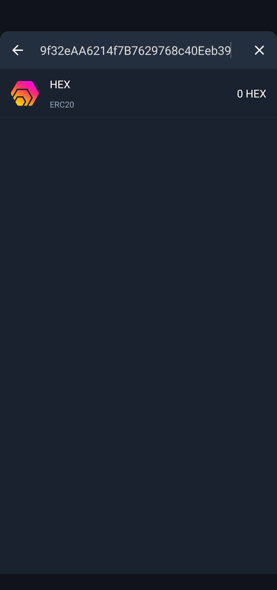
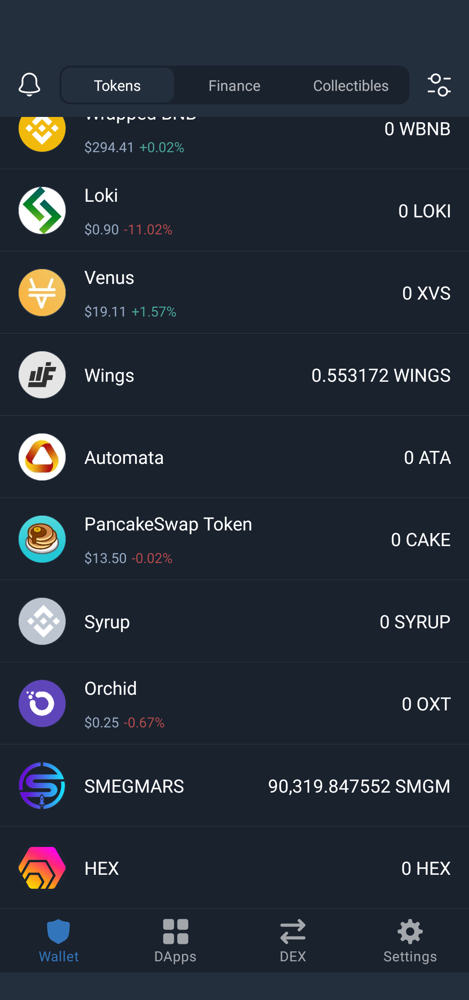
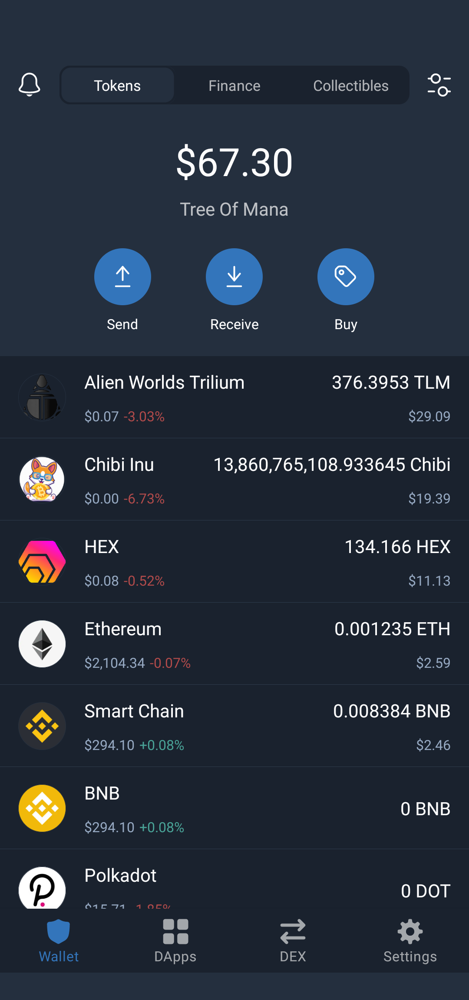

This is a stub. More to come on all of these topics, especially CAKE.

[HEX](https://hex.com/) looks very cool, and is a good choice for long-term investment in the crypto world. Why? Check out their excellent site. We'll feature a more detailed explanation soon!

> HEX is an ERC-20 token, a programmable asset

Here's [the Etherscan listing for HEX](https://etherscan.io/address/0x2b591e99afe9f32eaa6214f7b7629768c40eeb39), where you'll find the contract address you'll need to copy and and paste. I'll just share it here, too, but please go verify it yourself if you feel the need.

> 0x2b591e99afE9f32eAA6214f7B7629768c40Eeb39

TrustWallet will work well as a place to add this address, and then you can Exchange a currency like ETH for HEX. Hold the HEX for a long time, or stake it for compounding interest. More to come...

